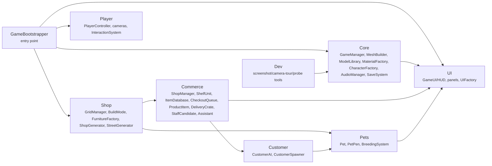

<!-- generated:start cap:overview-intro -->
# Architecture Overview

4 component(s) declared on the architecture canvas. Topology: [system-map.md](system-map.md).
<!-- generated:end cap:overview-intro -->

<!-- generated:start comp:pet-shop-simulator-game-client -->
## Pet Shop Simulator (Game Client) (`pet-shop-simulator-game-client`, FRONTEND)

Single-player, first-person 3D shop-management sim. GameBootstrapper is the whole entry point: it builds the grid/shop/build/spawner/audio/manager systems, generates the shop room and street via procedural + Kenney-kit geometry, assembles the player and UI, then hands control to GameManager for the day loop (customers, stocking, breeding, rent). No backend/server - everything runs client-side in one Unity process; all furniture placement funnels through BuildMode.Place() -> FurnitureFactory.Spawn() and audio is synthesised at startup (no sound files).

**Tech:** Unity 6000.6.2f1, C#, Built-in Render Pipeline, UGUI (com.unity.ugui), AI Navigation / NavMesh (com.unity.ai.navigation), Unity Timeline, Unity Purchasing, Unity Test Framework

**Internal structure:**

<!-- generated:end comp:pet-shop-simulator-game-client -->

<!-- generated:start comp:build-editor-tooling -->
## Build & Editor Tooling (`build-editor-tooling`, CUSTOM)

Editor-time / headless tooling (Assets/Editor, driven by root build.sh) that sets up the project (TextMesh Pro essentials, Always-Included Shaders), generates the scene (SceneBuilder, GameBuilder), imports/reports on Kenney and Asset Store art, verifies spawns/materials/shaders, and produces the Linux player build plus smoke-test screenshots. Runs only at build/dev time - never shipped in the game itself.

**Tech:** Unity Editor scripting (UnityEditor), Bash (build.sh), Headless Linux batchmode build
<!-- generated:end comp:build-editor-tooling -->

<!-- generated:start comp:local-save-file -->
## Local Save File (`local-save-file`, STORAGE)

Single JSON save file at Application.persistentDataPath/petshop_save.json, written/read by Core/SaveSystem.cs. Holds the entire persisted game state: balance, reputation, day, staff, price multiplier, shelf/warehouse stock, and every placed furniture item with its shelf stock or pen residents (pets). Versioned (SaveData.Version) - on load, SaveSystem.TryRead passes every save through Core/SaveMigrator.cs, which upgrades older saves (legacy v0 and v1) in memory to the current version instead of discarding them.

**Tech:** JsonUtility (Unity built-in JSON), Local filesystem (Application.persistentDataPath)
<!-- generated:end comp:local-save-file -->

<!-- generated:start comp:soak-telemetry-log -->
## Soak Telemetry Log (JSONL) (`soak-telemetry-log`, STORAGE)

Dev-only JSON-lines file written by DayTelemetry (Assets/Scripts/Dev/DayTelemetry.cs) during soak runs: one JSON record appended per in-game day plus a final run-summary record, via File.AppendAllText. Only produced when GameBootstrapper.AttachTelemetry attaches the component because -telemetry or -quitafterdays was passed on the command line; normal play never writes it. Separate from the Local Save File and never read back by the game.
<!-- generated:end comp:soak-telemetry-log -->
