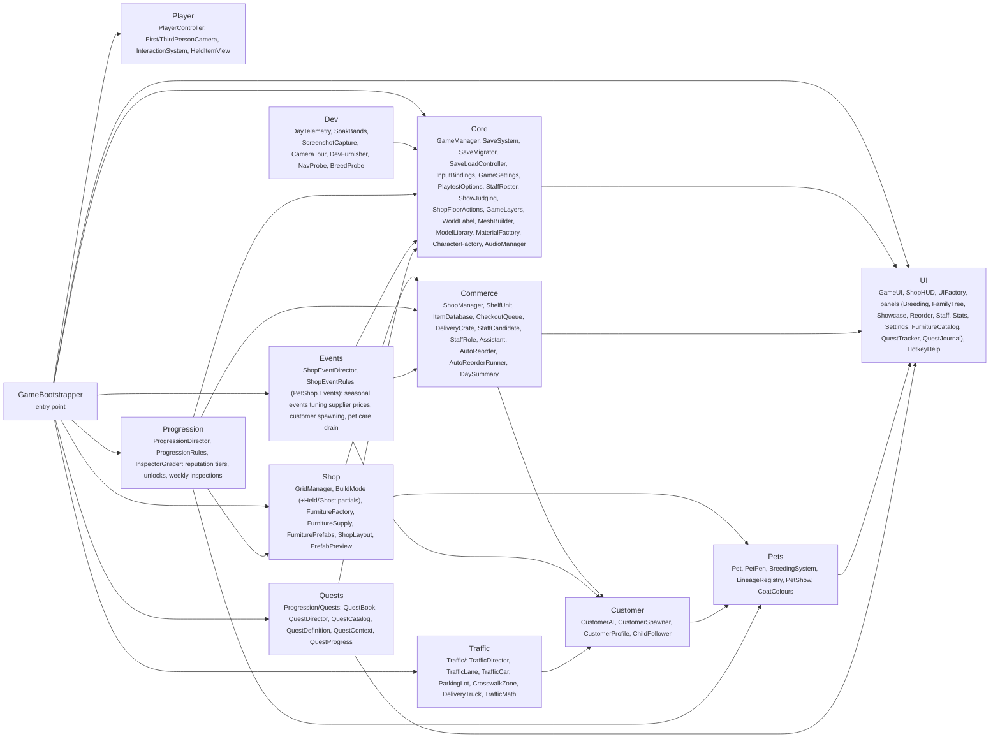

<!-- generated:start cap:overview-intro -->
# Architecture Overview

5 component(s) declared on the architecture canvas. Topology: [system-map.md](system-map.md).
<!-- generated:end cap:overview-intro -->

<!-- generated:start comp:pet-shop-simulator-game-client -->
## Pet Shop Simulator (Game Client) (`pet-shop-simulator-game-client`, FRONTEND)

Single-player, first-person 3D shop-management sim. The world (shop room and street) is authored in the editor in MainScene.unity - nothing generates it at runtime. GameBootstrapper is the whole entry point: it builds the grid/shop/build/spawner/audio/manager systems on top of the authored scene, assembles the player and UI, then hands control to GameManager for the day loop (customers, stocking, breeding, rent). No backend/server - everything runs client-side in one Unity process; all furniture placement funnels through BuildMode.Place() -> FurnitureFactory.Spawn() and audio is synthesised at startup (no sound files).

**Tech:** Unity 6000.6.2f1, C#, Built-in Render Pipeline, UGUI (com.unity.ugui), AI Navigation / NavMesh (com.unity.ai.navigation), Unity Timeline, Unity Purchasing, Unity Test Framework, ugui 2.6.0, ai.navigation 2.0.14, test-framework 1.8.0, timeline 6.6.0, purchasing 5.0.0

**Internal structure:**

```mermaid
flowchart LR
    bootstrapper["GameBootstrapper<br/><small>entry point</small>"]
    core["Core<br/><small>GameManager, SaveSystem, SaveMigrator, SaveLoadController, InputBindings, GameSettings, PlaytestOptions, StaffRoster, ShowJudging, ShopFloorActions, GameLayers, WorldLabel, MeshBuilder, ModelLibrary, MaterialFactory, CharacterFactory, AudioManager</small>"]
    shop["Shop<br/><small>GridManager, BuildMode (+Held/Ghost partials), FurnitureFactory, FurnitureSupply, FurniturePrefabs, ShopLayout, PrefabPreview</small>"]
    player["Player<br/><small>PlayerController, First/ThirdPersonCamera, InteractionSystem, HeldItemView</small>"]
    customer["Customer<br/><small>CustomerAI, CustomerSpawner, CustomerProfile, ChildFollower</small>"]
    commerce["Commerce<br/><small>ShopManager, ShelfUnit, ItemDatabase, CheckoutQueue, DeliveryCrate, StaffCandidate, StaffRole, Assistant, AutoReorder, AutoReorderRunner, DaySummary</small>"]
    pets["Pets<br/><small>Pet, PetPen, BreedingSystem, LineageRegistry, PetShow, CoatColours</small>"]
    ui["UI<br/><small>GameUI, ShopHUD, UIFactory, panels (Breeding, FamilyTree, Showcase, Reorder, Staff, Stats, Settings, FurnitureCatalog, QuestTracker, QuestJournal), HotkeyHelp</small>"]
    dev["Dev<br/><small>DayTelemetry, SoakBands, ScreenshotCapture, CameraTour, DevFurnisher, NavProbe, BreedProbe</small>"]
    progression["Progression<br/><small>ProgressionDirector, ProgressionRules, InspectorGrader: reputation tiers, unlocks, weekly inspections</small>"]
    quests["Quests<br/><small>Progression/Quests: QuestBook, QuestDirector, QuestCatalog, QuestDefinition, QuestContext, QuestProgress</small>"]
    events["Events<br/><small>ShopEventDirector, ShopEventRules (PetShop.Events): seasonal events tuning supplier prices, customer spawning, pet care drain</small>"]
    traffic["Traffic<br/><small>Traffic/: TrafficDirector, TrafficLane, TrafficCar, ParkingLot, CrosswalkZone, DeliveryTruck, TrafficMath</small>"]
    bootstrapper --> core
    bootstrapper --> shop
    bootstrapper --> player
    bootstrapper --> ui
    core --> ui
    shop --> commerce
    shop --> pets
    commerce --> customer
    customer --> pets
    commerce --> ui
    pets --> ui
    dev --> core
    bootstrapper --> progression
    progression --> core
    progression --> shop
    progression --> commerce
    progression --> pets
    bootstrapper --> events
    events --> core
    events --> commerce
    events --> customer
    bootstrapper --> quests
    quests --> core
    quests --> ui
    bootstrapper --> traffic
    traffic --> customer
```
<!-- generated:end comp:pet-shop-simulator-game-client -->

<!-- generated:start comp:build-editor-tooling -->
## Build & Editor Tooling (`build-editor-tooling`, CUSTOM)

Editor-time / headless tooling (Assets/Editor, driven by root build.sh and Tools/). build.sh targets: setup, linux, windows, run, smoke (90s timeout), test (EditMode), playmode (gating run with -testCategory '!KnownIssue', then non-gating KnownIssue run), soak (400s timeout), spawnverify, playtest, look (not run with -nographics), look-diff, look-approve, assets, kenney, plus a no-op scene. It clears a stale Temp/UnityLockfile before each run. Asset steps use Tools/fetch_kenney.sh, Tools/unpack_unitypackage.py and Tools/organise_packs.py (packs are extracted with Python, not Unity's importer). Editor entry points: GameBuilder.BuildLinux/BuildWindows (builds the hand-authored MainScene.unity), ProjectSetup.ImportTMPEssentials, ShaderInclusion.EnsureIncluded, MaterialRepair.Repair, SpawnVerify.Verify, SceneShot.Capture, ScreenshotDiff.Compare/Approve, AssetStoreImporter.Report/ImportAll, KenneyAssetReport, KenneyBoundsDump, FacingProbe, GfxProbe (not driven by build.sh), KenneyModelPostprocessor. Never shipped in the game.

**Tech:** Unity Editor scripting (UnityEditor), Bash (build.sh), Headless Linux batchmode build, Python (Tools/*.py asset unpacking), Windows build target
<!-- generated:end comp:build-editor-tooling -->

<!-- generated:start comp:local-save-file -->
## Local Save File (`local-save-file`, STORAGE)

Up to three JSON save slots (petshop_save_1..3.json under Application.persistentDataPath, a file naming scheme - not a field); a legacy petshop_save.json is migrated into slot 1 on first run. Writes go to a .tmp file which is swapped in, leaving a .bak; Load falls back to the .bak if the main file is bad. Current save version is 5; older saves are migrated in memory by SaveMigrator. The -savepath flag overrides slot 1 only. SlotFile in the schema below is a naming scheme, not a SaveData field; Staff defaults to 1.

**Tech:** JsonUtility (Unity built-in JSON), Local filesystem (Application.persistentDataPath)
<!-- generated:end comp:local-save-file -->

<!-- generated:start comp:player-prefs-store -->
## PlayerPrefs Settings Store (`player-prefs-store`, STORAGE)

Unity PlayerPrefs store for per-machine player preferences, written with PlayerPrefs.SetString + PlayerPrefs.Save(). Keys: settings.autosaveMorning (default "1", GameSettings.cs), settings.showQuestTracker (default "1", GameSettings.cs), and bind.<GameAction> per key binding (InputBindings.cs, PlayerPrefsBindingStore). Separate from the Local Save File, which holds game-progress state.

**Tech:** Unity PlayerPrefs
<!-- generated:end comp:player-prefs-store -->
<!-- generated:start comp:soak-telemetry-log -->
## Soak Telemetry Log (JSONL) (`soak-telemetry-log`, STORAGE)

Dev-only JSON-lines file written by DayTelemetry (Assets/Scripts/Dev/DayTelemetry.cs) during soak runs, via File.AppendAllText; attached by GameBootstrapper.AttachTelemetry only when -telemetry or -quitafterdays is passed. Per-day record (SoakBands.DayRecord): day, seed, sales, revenue, checkouts, walkoutsEmpty, gaveUp, navTimeouts, strandedCheckouts, reputation, balance. Final summary line (DayTelemetry.RunSummary): summary:true, days, seed, violations, exitCode. Exit code 0 when clean, 3 when a SoakBands band is violated (SoakBands.NoSeed = -1). Never read back by the game.
<!-- generated:end comp:soak-telemetry-log -->
