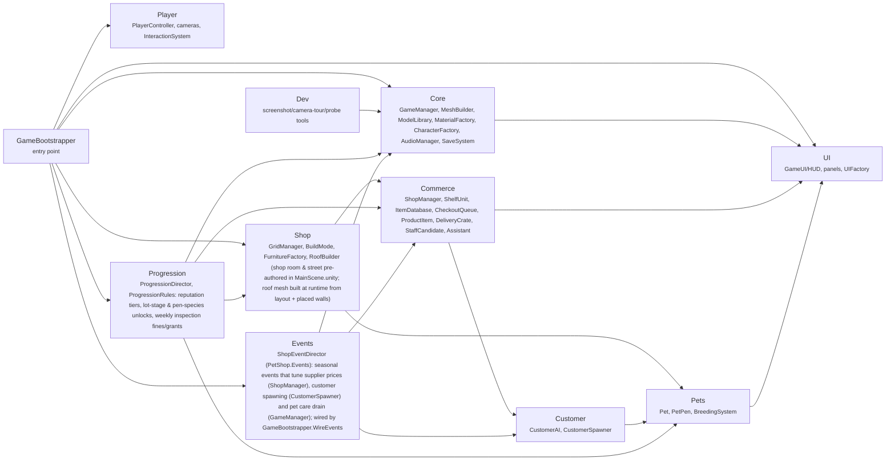

<!-- generated:start cap:overview-intro -->
# Architecture Overview

5 component(s) declared on the architecture canvas. Topology: [system-map.md](system-map.md).
<!-- generated:end cap:overview-intro -->

<!-- generated:start comp:pet-shop-simulator-game-client -->
## Pet Shop Simulator (Game Client) (`pet-shop-simulator-game-client`, FRONTEND)

Single-player, first-person 3D shop-management sim. The world (shop room and street) is authored in the editor in MainScene.unity; the one runtime-generated exception is the shop roof, which RoofBuilder builds as a collider-free mesh (Scenery layer) over the shell footprint and the cells under/enclosed by player-built walls, rebuilding whenever a wall is placed or removed. GameBootstrapper is the whole entry point: it builds the grid/shop/build/spawner/audio/manager systems (including the Roof) on top of the authored scene, assembles the player and UI, then hands control to GameManager for the day loop (customers, stocking, breeding, rent). No backend/server - everything runs client-side in one Unity process; all furniture placement funnels through BuildMode.Place() -> FurnitureFactory.Spawn() and audio is synthesised at startup (no sound files).

**Tech:** Unity 6000.6.2f1, C#, Built-in Render Pipeline, UGUI (com.unity.ugui), AI Navigation / NavMesh (com.unity.ai.navigation), Unity Timeline, Unity Purchasing, Unity Test Framework

**Internal structure:**

```mermaid
flowchart LR
    bootstrapper["GameBootstrapper<br/><small>entry point</small>"]
    core["Core<br/><small>GameManager, MeshBuilder, ModelLibrary, MaterialFactory, CharacterFactory, AudioManager, SaveSystem</small>"]
    shop["Shop<br/><small>GridManager, BuildMode, FurnitureFactory, RoofBuilder (shop room & street pre-authored in MainScene.unity; roof mesh built at runtime from layout + placed walls)</small>"]
    player["Player<br/><small>PlayerController, cameras, InteractionSystem</small>"]
    customer["Customer<br/><small>CustomerAI, CustomerSpawner</small>"]
    commerce["Commerce<br/><small>ShopManager, ShelfUnit, ItemDatabase, CheckoutQueue, ProductItem, DeliveryCrate, StaffCandidate, Assistant</small>"]
    pets["Pets<br/><small>Pet, PetPen, BreedingSystem</small>"]
    ui["UI<br/><small>GameUI/HUD, panels, UIFactory</small>"]
    dev["Dev<br/><small>screenshot/camera-tour/probe tools</small>"]
    progression["Progression<br/><small>ProgressionDirector, ProgressionRules: reputation tiers, lot-stage & pen-species unlocks, weekly inspection fines/grants</small>"]
    events["Events<br/><small>ShopEventDirector (PetShop.Events): seasonal events that tune supplier prices (ShopManager), customer spawning (CustomerSpawner) and pet care drain (GameManager); wired by GameBootstrapper.WireEvents</small>"]
    bootstrapper --> core
    bootstrapper --> shop
    bootstrapper --> player
    bootstrapper --> ui
    core --> ui
    shop --> commerce
    shop --> pets
    commerce --> customer
    customer --> pets
    commerce --> ui
    pets --> ui
    dev --> core
    bootstrapper --> progression
    progression --> core
    progression --> shop
    progression --> commerce
    progression --> pets
    bootstrapper --> events
    events --> core
    events --> commerce
    events --> customer
```
<!-- generated:end comp:pet-shop-simulator-game-client -->

<!-- generated:start comp:build-editor-tooling -->
## Build & Editor Tooling (`build-editor-tooling`, CUSTOM)

Editor-time / headless tooling (Assets/Editor, driven by root build.sh) that sets up the project (TextMesh Pro essentials, Always-Included Shaders), builds the player from the hand-authored, checked-in Assets/Scenes/MainScene.unity (GameBuilder - the tooling no longer generates the scene), imports/reports on Kenney and Asset Store art, verifies spawns/materials/shaders, and produces the Linux player build plus smoke-test screenshots. Runs only at build/dev time - never shipped in the game itself.

**Tech:** Unity Editor scripting (UnityEditor), Bash (build.sh), Headless Linux batchmode build
<!-- generated:end comp:build-editor-tooling -->

<!-- generated:start comp:local-save-file -->
## Local Save File (`local-save-file`, STORAGE)

Up to three JSON save slots (petshop_save_1..3.json under Application.persistentDataPath); a legacy petshop_save.json is migrated into slot 1 on first run.

**Tech:** JsonUtility (Unity built-in JSON), Local filesystem (Application.persistentDataPath)
<!-- generated:end comp:local-save-file -->

<!-- generated:start comp:player-prefs-store -->
## PlayerPrefs Settings Store (`player-prefs-store`, STORAGE)

Unity PlayerPrefs store for per-machine player preferences: key bindings (InputBindings.cs, PlayerPrefsBindingStore) and settings such as the autosave preference (GameSettings.cs). Separate from the Local Save File, which holds game-progress state.

**Tech:** Unity PlayerPrefs
<!-- generated:end comp:player-prefs-store -->
<!-- generated:start comp:soak-telemetry-log -->
## Soak Telemetry Log (JSONL) (`soak-telemetry-log`, STORAGE)

Dev-only JSON-lines file written by DayTelemetry (Assets/Scripts/Dev/DayTelemetry.cs) during soak runs: one JSON record appended per in-game day plus a final run-summary record, via File.AppendAllText. Only produced when GameBootstrapper.AttachTelemetry attaches the component because -telemetry or -quitafterdays was passed on the command line; normal play never writes it. Separate from the Local Save File and never read back by the game.
<!-- generated:end comp:soak-telemetry-log -->
